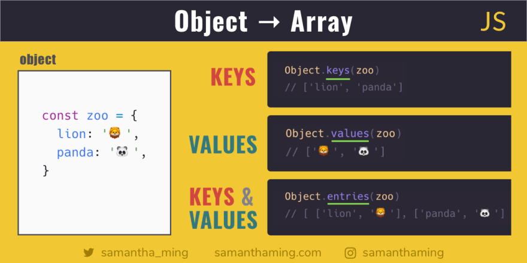
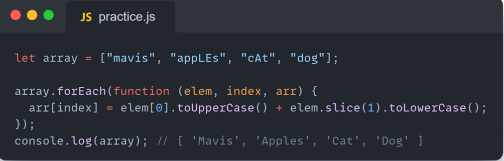

### What is array  in JavaScript ?
#### Array is a list element meboshad ki yakchand namud zhacheni kabul mekha.
#### Array method
#### pop( )
#### az oxir udalit mekna.

#### push( )
#### az oxir dobavit mekna

#### shift( )
#### az aval udalit mekna.

#### unshift( )
#### az aval dobavit mekna

#### toString( )
#### array string mekna

#### indexOf( )
#### indexOf indexi elementa meta

#### includes( )
#### masanja ki agar hamu element da daru ni arr bosh true mege agar nabosha false

#### concat( )
#### konekt to string 

#### silce( )
#### slice it take to parameter start finish

#### splice( )
#### 3 parameter qabul mekna
#### 1.chika delate kuna 
#### 2.chanbor
#### 3.bajosh chika mona

## Method ho dar array and callbacks
### What is callback ?
####  
#### map( )
#### map is a method that is crateing array calback dor 1 calback calback has to parameter.
#### forEach( )
#### it is a method that has callback in cllback has 3 parameter 1.value 2.index 3.array 

#### find( )
#### find is a method in array that it work one time and if element equal to the condition and it will show it directy.

#### filter( )
#### is a method that check the all element

#### reduce( )
#### is a method that has a callback callback has 4 parameter reduce has 2 parameter

#### toSorted( )
#### parydak mekna

#### Mechanism Destrusturing
#### elementoi array metona da yk variable bbakhshem

#### spread ( )
#### elementhoi array in one variable will do copy

#### rest ( )
#### it is a mechanism syntax is with 3 dot ...arr  infinity element qabul mekna

