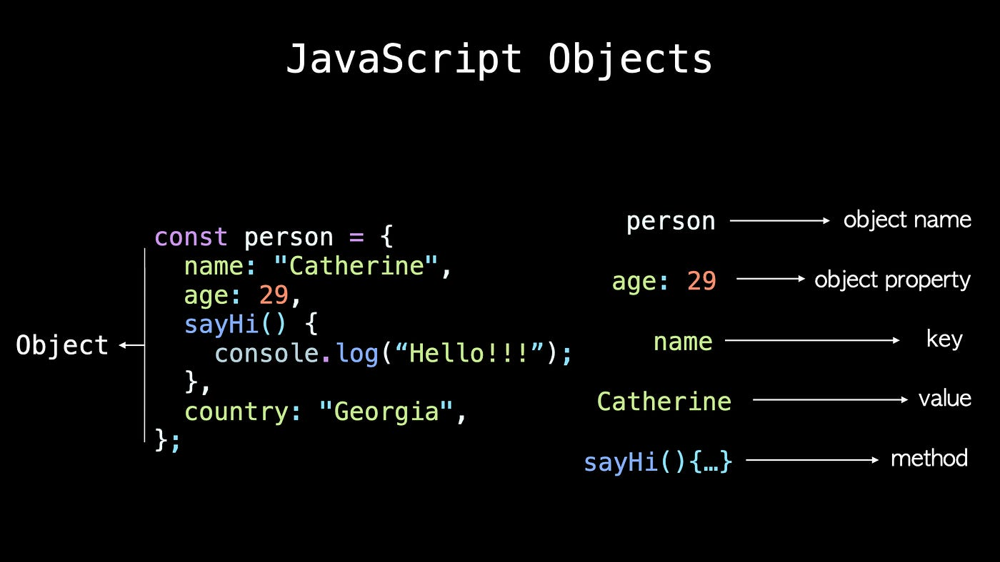

## Object in JavaScript ?
### collection of properties that properties has key and value .
###  
#### Method of object 

#### Object.entries( ) 
#### It will give you the key and value in one  array
#### Object.key( ) 
#### It will show you the keys
#### Object.value( ) 
#### It will the value
### What is Destructuring & Spread in JS ?
#### Destructuring is a mechanism ast ki key objecta  mekunad.
#### Spread 
### That is " THIS " in JavaScript ?
#### It is keyword ast ki 4 holat 1.show the object  2,3 show the global  4. if you put the strict mode it will show you the underfind 
